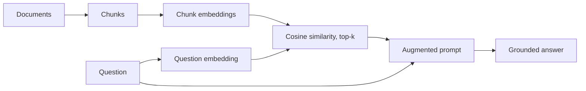

# 02 · RAG from scratch

A retrieval-augmented generation (RAG) pipeline built step by step in a Jupyter notebook, with no RAG framework, so every step is visible.
Use case: a small retail customer-support assistant.



## Files

| File | Purpose |
|------|---------|
| `rag.ipynb` | The walkthrough: run it cell by cell and read each output |
| `rag_utils.py` | Chunking, cosine similarity, top-k search, prompt building, embedding call |
| `test_rag_utils.py` | Unit tests for the pure functions (no API key needed) |
| `docs/` | Five small sample documents (returns, shipping, warranty, payment, support hours) |

## Run it

```bash
python -m venv venv && source venv/bin/activate
pip install -r requirements.txt
cp .env.example .env            # add your Gemini API key
pytest                          # tests run offline
jupyter notebook rag.ipynb
```

Choose the `venv` kernel in Jupyter (if it is missing: `python -m ipykernel install --user --name urai-rag`).

## The steps

1. **Chunking:** paragraph-level chunks, with long paragraphs split by sentence.
2. **Embeddings:** every chunk becomes a vector with the Gemini embedding model.
3. **Retrieval:** embed the question and rank the chunks by cosine similarity.
4. **Augmentation:** build a prompt that contains only the retrieved context and the question.
5. **Generation:** the Gemini model answers from that context, or says it does not know.

## What I learned

- Retrieval quality decides answer quality.
- Chunk size and top-k are trade-offs you should test, not guess.
- Separating pure functions from API calls makes the code testable.

## Next steps

- Self-healing (corrective) RAG that grades the retrieved context and retries
- Retrieval evaluation with a set of test questions
- Tool use (function calling) on top of the pipeline
